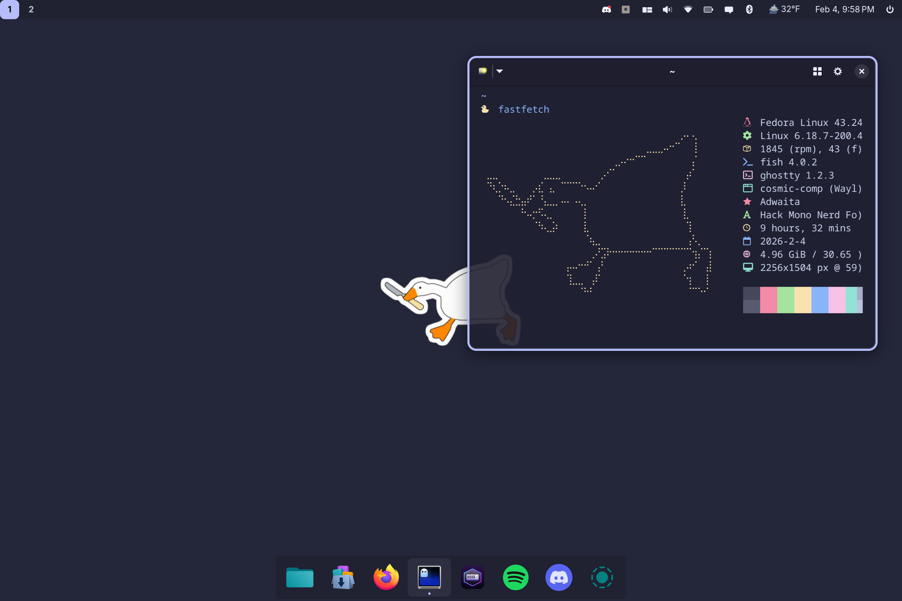

<div align="center">
  
</div>

## `goose`: given's open-source operating system environment

<div align="center">
  

  

  
</div>

## About

This is a custom Linux build designed around Fedora's [Atomic Desktops](https://fedoraproject.org/atomic-desktops/), as a community-driven adaptation of the [Universal Blue](https://universal-blue.org/) project. These systems are immutable by nature, which means users are actually gated from directly modifying the system, providing an incredibly secure form of interacting with the Linux platform.

This is the OS I use daily on a Framework 13 laptop. It features the [COSMIC desktop environment](https://system76.com/cosmic/) and anything you could want for containerized development. It's unopinionated by design, other than preferring [Ghostty](https://ghostty.org/) for the terminal, and [Catppuccin](https://catppuccin.com/) for the system theme.

This was previously handcrafted using all kinds of build scripts and `systemd` hacks, but has since switched to a declarative [BlueBuild](https://blue-build.org) structure. Alongside being easier to maintain, I've also gotten it to replicate the functionality of an operating system like Nix. The image bootstraps itself into the filesystem and `bootc` can actually rebase to it locally, meaning we can document desired packages or system-level changes and rebuild our system in one go.

<div align="center">
  
</div>

## Installation

Verify the image signature with `cosign`:

```bash
cosign verify --key \
https://github.com/givensuman/goose/raw/main/cosign.pub \
ghcr.io/givensuman/goose
```

Then rebase from any Fedora Atomic image by running the following:

```bash
sudo bootc switch --enforce-container-sigpolicy ghcr.io/givensuman/goose
```

A [base Fedora image](https://fedoraproject.org/atomic-desktops/silverblue/download) will have a smaller ISO size and give you a more reasonable point to rollback to in the future.



<div align="center">
  
</div>

### Usage

Additional system utilities are run through Just, and can be seen by running `ujust`.

For development, use `distrobox create` to create a mutable, containerized OS, and `distrobox enter` to enter into it.

<div align="center">
  
</div>

## Secure Boot

Secure Boot is enabled by default on Universal Blue builds, adding an extra layer of security. During the initial installation, you will be prompted to enroll the secure boot key in the BIOS. To do so, enter the password `universalblue` when asked.

If this step is skipped during setup, you can manually enroll the key by running the following command in the terminal:

```
ujust enroll-secure-boot-key
```

Secure Boot works with Universal Blue's custom key, which can be found in the root of the akmods repository [here](https://github.com/ublue-os/akmods/raw/main/certs/public_key.der).
To enroll the key before installation or rebase, download the key and run:

```bash
sudo mokutil --timeout -1
sudo mokutil --import public_key.der
```

<div align="center">
  
</div>

## Issues

For issues with the images, feel free to submit an issue in this repository. For COSMIC related issues, please see [cosmic-epoch/issues](https://github.com/pop-os/cosmic-epoch/issues).
