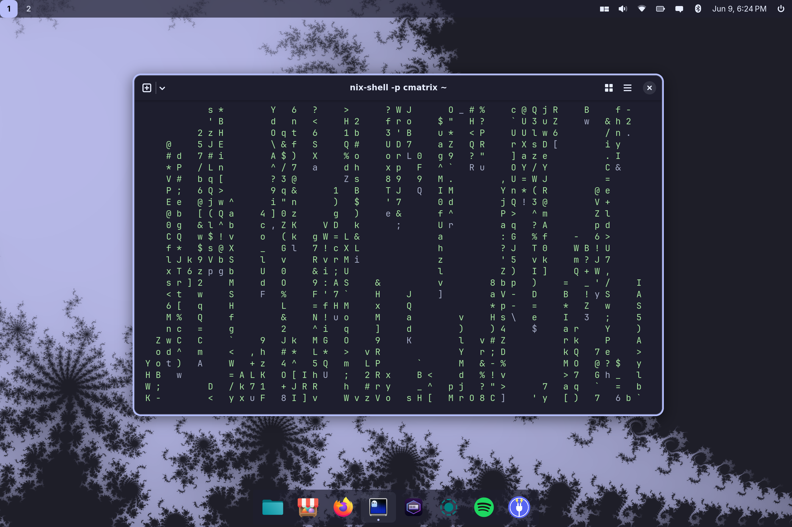

## `goose`: given's open-source operating system environment


## About

This is a custom Linux build designed around Fedora's [Atomic Desktops](https://fedoraproject.org/atomic-desktops/) and built for [bootc](https://github.com/bootc-dev/bootc), as a community-driven adaptation of the [Universal Blue](https://universal-blue.org/) project. These systems are immutable by nature, which means users are actually gated from directly modifying the system, providing an incredibly secure form of interacting with the Linux platform.

## Installation

Verify the image signature with `cosign`:

```bash
cosign verify \
  --certificate-identity-regexp '^https://github.com/givensuman/goose/.github/workflows/build-os.yml@refs/heads/main$' \
  --certificate-oidc-issuer https://token.actions.githubusercontent.com \
  ghcr.io/givensuman/goose:stable
```

You can download an ISO from the latest [GitHub Action Build Artifact](https://github.com/givensuman/goose/actions/workflows/build_iso.yml). GitHub requires you be logged in to download.

ISOs are signed with keyless Sigstore signatures. Download the matching `.sig` and `.cert` artifacts and verify with:

```bash
cosign verify-blob \
  --certificate-identity-regexp '^https://github.com/givensuman/goose/.github/workflows/build_iso.yml@refs/heads/main$' \
  --certificate-oidc-issuer https://token.actions.githubusercontent.com \
  --signature goose-stable.iso.sig \
  --certificate goose-stable.iso.cert \
  goose-stable.iso
```

Alternatively, and preferably for most users, you can rebase from any Fedora
Atomic image by running the following:

```bash
sudo bootc switch --enforce-container-sigpolicy ghcr.io/givensuman/goose:stable
```

A [base Fedora image](https://fedoraproject.org/atomic-desktops/silverblue/download)
will have a smaller ISO size and give you a more reasonable point to rollback to
in the future.

## Usage

You can layer whatever core packages you like on top of this build. I recommend
installing your favorite shell:

```bash
rpm-ostree install --apply-live fish
sudo usermod -s $(which fish) $USER
```

And then get the rest of your software through `flatpak` or with `nix`:

```bash
flatpak install flathub org.mozilla.firefox
```

```bash
nix-shell -p \
  bat \
  eza \
  fd \
  ripgrep \
  zoxide
```


*goose running the COSMIC desktop*

## License

[Apache-2.0](./LICENSE)
